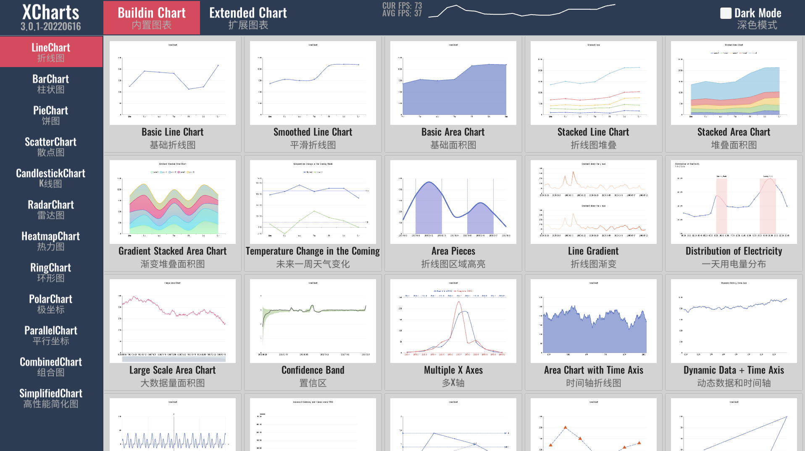
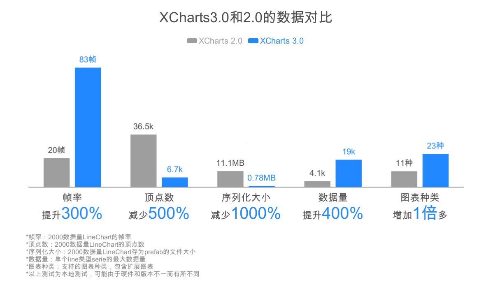
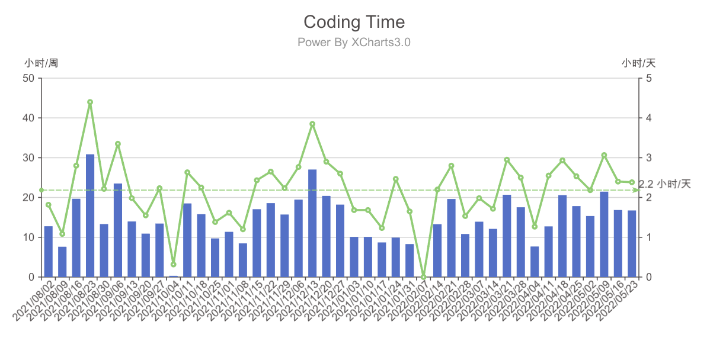
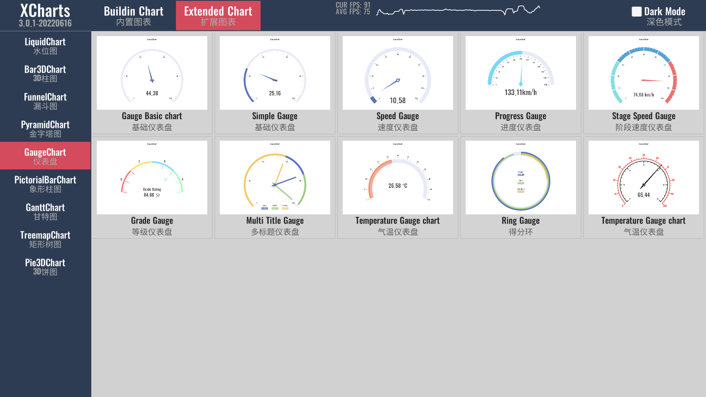
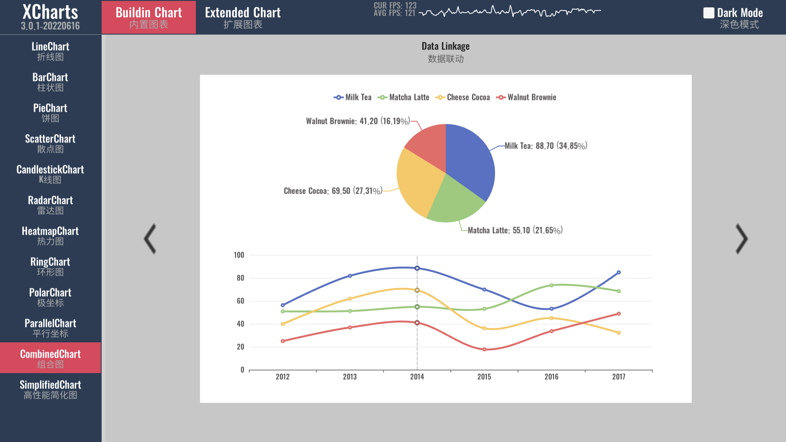

# XCharts3.0发布

历时8个多月，业余时间，断断续续，[XCharts3.0](https://github.com/XCharts-Team/XCharts) 总算发布了。如果要打个满意度，我给 3.0 版本来个80分。

<!-- truncate -->

对于代码框架结构设计的调整改动，基本符合预期，甚是满意。相比之前的 1.0 和 2.0 版本，我认为 3.0 才是一个拿得出手给广大开发者使用的版本。1.0 发布的时候，很兴奋，从 0.1 到 1.0，也磨了一年，真的等不及想给大家试用了，还特地写过一篇文章以示庆祝。那个时候，1.0 虽然还还不够完善，功能也不够丰富，但它是[XCharts](https://github.com/XCharts-Team/XCharts)的开始，没有 1.0，也就没有后面的 2.0 和 3.0。

后面的 2.0 发布，做了很多改进和优化，随着版本迭代，慢慢的发现有不少硬伤需要进行大量重构才能解决。当我知道 2.0 还有些硬伤时，也就没什么心思花在推广运营上了，当时的想法很简单，不希望大量用户使用后还要进行不兼容升级版本，也不想把明知道还不够好的作品推荐给别人，更不想别人看了项目源码后感慨：这是一坨啥玩意？这促使我要开发一个够健壮的，兼容性够好的，解决已知硬伤的版本出来，也就是 3.0 。

终归因为精力和时间有限，源码部分是基本完成了，但在文档、教程等方面还是不够完善，多少给3.0的发布留下了点不足。这些只能后面再继续完善了。但说实话，相比写文档教程文章，我还是更愿意安安静静地写代码。

## 为什么要开发 XCharts3.0？

一言以蔽之，之前的版本不够好，有硬伤有痛点。一些设计和框架上的问题并不是迭代和优化可以解决的，必须推倒重构重新设计。那之前的版本有哪些方面的痛点呢？总结一下主要有以下两大方面：

1. 代码结构上，框架设计不够合理，代码低内聚高耦合，臃肿不方便功能扩展，不利于项目维护。
2. 功能使用上，图表无法任意组合，组件无法热插拔，性能优化天花板太低。

其实这两大方面对用户是没什么影响，反而在使用上 2.0 版本还更好用一点。这有点像Unity，早期的版本可以直接访问组件，而后面的版本需要先 GetComponent。

原因的话主要是早期做[XCharts](https://github.com/XCharts-Team/XCharts)时是没想道要做这么完善的，我只是想做个简单的图表工具自己用而已，再加上可支持的图表种类和组件真是太多了，如果一开始没有很好的规划和设计，框架是很难兼容所有需求的。况且，好的架构，都是在持续迭代和重构过程中不断完善。

一个持续的项目在代码上要方便维护和扩展，要不然太难受了。我在做用户定制功能时深有体会，2.0 版本加一个扩展图表改动非常大，牵扯的地方较多，这样很容易出问题，不方便后面的功能增加和版本迭代。要知道，图表方面可迭代的需求可以源源不断。之前的版本就是点错了技能树，太注重性能优化，导致高内聚低耦合的基本编码原则成了摆设。作为一个图表插件，性能固然重要，但更应该把易用性、丰富性和体验性放在首位，让客户能做出他想要的炫酷好看的图表才是重点。

图表任意组合和组件热插拔也一直是我想支持的，[XCharts](https://github.com/XCharts-Team/XCharts) 也有参考 [ECharts](https://echarts.apache.org/zh/index.html) 的一些设计理念，[ECharts](https://echarts.apache.org/zh/index.html) 里对这两个就支持的很好。[XCharts](https://github.com/XCharts-Team/XCharts) 的 3.0 版本里，由于 Unity 的一些限制，只能做到内置图表的任意组合，或者扩展图表组合内置图表，而没法做到所有图表的任意组合，略有遗憾。

## XCharts3.0 有哪些变化？

3.0 版本对用户使用来说变化不大，但在源码层面基本改得面目全非了。Github仓库也转移到了专有组织 [XCharts-Team](https://github.com/XCharts-Team) 进行规范化社区维护。XCharts-Team 下除了 包含 [XCharts](https://github.com/XCharts-Team/XCharts) 核心仓库，还包含很多扩展图表仓库，后面计划会推出用 [XCharts](https://github.com/XCharts-Team/XCharts) 做的项目仓库，作为 [XCharts](https://github.com/XCharts-Team/XCharts) 的展示示例。

概括的说，[XCharts3.0](https://github.com/XCharts-Team/XCharts) 有几下几个方面的变化：

1. 代码框架结构上，进行重构重新设计，更合理更健壮，为以后的迭代和扩展打下基础。
2. 图表支持任意组合，组件可以热插拔。
3. 增加更多组件支持，更多细节处理。
4. 增加扩展图表支持。
5. 注重交互和用户体验。
6. 全新Demo示例，更快的知道[XCharts](https://github.com/XCharts-Team/XCharts)能做什么。
7. 增加[XCharts](https://github.com/XCharts-Team/XCharts)的[GitHub](https://github.com/XCharts-Team)组织，社区化规范化维护。
8. 新的VIP订阅服务，提供更好的技术支持。

## XCharts3.0 开发过程中碰到哪些问题？

碰到最大的问题主要还是Unity序列化，特别是范型序列化和递归序列化。Unity在序列化上的一些限制，使得[XCharts](https://github.com/XCharts-Team/XCharts)不得不采取一些折中的方案，代码略显得不够优雅。这也是[XCharts3.0](https://github.com/XCharts-Team/XCharts)开发前期碰到的最大阻力，导致方案调整了几次。

这对 [XCharts3.0](https://github.com/XCharts-Team/XCharts) 有两个直接的影响：一是扩展图表之间无法任意组合；二是递归的树状结构无法像正常一样构建，如在TreemapChart矩形树图中，就没法像ECharts那样优雅地配置数据。

## 扩展图表为何要付费，且要订阅VIP服务才能购买？

订阅VIP和扩展图表算是[XCharts](https://github.com/XCharts-Team/XCharts)商业模式的一种探索。这是[XCharts](https://github.com/XCharts-Team/XCharts)能长时间持续更新迭代和维护下去的决定因素。要先订阅VIP才能购买扩展图表也是为了更好的更全方位的技术服务。

知乎上有个问题：如何看待国内开源项目的不可持续性？很多答主从多方面回答了这个问题。要我回答的话，我觉得主要是：付出和（预期）收获不成正比。这里说的收获可以是经验、技术、成就和资金以及其他支持。

长时间维护一个需要持续迭代更新的大型开源项目，是很耗费精力和时间的。当付出远远大于收获时，项目就很难继续维护下去。[XCharts](https://github.com/XCharts-Team/XCharts)可能还谈不上大型开源项目，但由于图表项目的特殊性，可以有源源不断的需求等着开发，对我来说，哪怕把所有业余时间都投进去都开发不完。从耗费精力和时间上来看，[XCharts](https://github.com/XCharts-Team/XCharts)并不亚于其他大型开源项目。

维护一个有一定影响力的开源项目确实能从中获利不少。在我维护[XCharts](https://github.com/XCharts-Team/XCharts)的这四年，各方面的经验积累了不少，技术方面经过实战也更扎实也学到了一些新技术，也获得了一些成就感。资金方面虽然不多，但也用户订阅VIP服务和功能定制，让我也看到了些希望。然而，对于经验、技术、成就和资金这四方面，只有资金才具有持续性，其他几个并不会持续很长时间。

所以，长时间维护一个需要持续迭代更新的大型开源项目，持续的资金支持才是关键。这种资金支持不管是来源于商业模式，还是捐赠赞助，亦或是工资奖金等都可以。试想，Torvalds 如果没有资金上的支持，不知他是否还能全职专心的维护 Linux。用爱发电，为爱发电两三年还能可以，再长时间，很难。

## 关于时间管理

如果你也是一位搞游戏开发的有家庭有小孩的还经常加班的上班族，应该能体会业余时间维护自己的项目有多么不容易，更别说平均每天还能抽出2个多小时来写代码了，这需要很大的毅力和动力。

这些时间花的值不值？谁知道呢，我只知道，如果这些时间用来玩游戏，刷某音，看网络小说，时间就在不知不觉中流逝，什么都没有留下。而现在，至少我还留下了[XCharts](https://github.com/XCharts-Team/XCharts)。[XCharts](https://github.com/XCharts-Team/XCharts)确实也帮助到了不少开发者。

我不是时间管理大师，只是想坚持每天做会项目，写会代码。用业余时间做项目靠的是自律和坚持，讲究一鼓作气，因为人是懒惰的，只要一段时间不弄，就会思路和规划对不上，嫌麻烦，提不起兴趣，就不再想去弄了。

然而，一个人的时间总是固定的，花在项目上的时间多了，花其他方面的时间自然也就相对减少了，比如家庭，比如学习，比如休息和锻炼。这也是我以后我要多平衡的地方。

## 关于ECharts

用过[XCharts](https://github.com/XCharts-Team/XCharts)的开发者应该都发现了，[XCharts](https://github.com/XCharts-Team/XCharts)的风格有点类似[ECharts](https://echarts.apache.org/zh/index.html)。没错，[XCharts](https://github.com/XCharts-Team/XCharts)在不少方面确实参考和借鉴了[ECharts](https://echarts.apache.org/zh/index.html)，在一些概念，命名和风格方面尽量保持和[ECharts](https://echarts.apache.org/zh/index.html)一致。在Demo方面干脆就是直接复刻了[ECharts](https://echarts.apache.org/zh/index.html)的Demo。

一是为了减少用户的学习和使用成本。[ECharts](https://echarts.apache.org/zh/index.html)在前端可视化领域是极具影响力的，图表类型丰富，开源，文档和Demo齐全。对于有[ECharts](https://echarts.apache.org/zh/index.html)经验的开发者，可以直接上手[XCharts](https://github.com/XCharts-Team/XCharts)，不用再重新学习另外一套图表。哪怕没用过[ECharts](https://echarts.apache.org/zh/index.html)，它上面的文档和Demo对开发者也有很大帮助，因为早期[XCharts](https://github.com/XCharts-Team/XCharts)在文档和Demo方面并不完善，而[XCharts](https://github.com/XCharts-Team/XCharts)和[ECharts](https://echarts.apache.org/zh/index.html)在很多方面概念是相通的。

二是为了减少[XCharts](https://github.com/XCharts-Team/XCharts)的开发成本。除了一些概念和命名，特别在配色和Demo设计方面，没有参考的话，可够让这种没啥艺术细胞的程序员头疼的。英文文档翻译也是，这么多配置项参数要翻译。有了[ECharts](https://echarts.apache.org/zh/index.html)做参考，确实省了我不少时间，让我能把主要精力放在编程上，加快开发效率。

## 关于后续发展

[XCharts](https://github.com/XCharts-Team/XCharts)，始于开源，成长于开源，也回馈了开源。时至今日，[XCharts](https://github.com/XCharts-Team/XCharts)迭代了将近四年，发布了大大小小共45个版本，其中3个大版本，平均一个月一个版本。最新的[XCharts3.0](https://github.com/XCharts-Team/XCharts)版本，代表着[XCharts](https://github.com/XCharts-Team/XCharts)已成年，将开启新的探索旅程。

元宇宙，将会是下一个十年互联网的趋势。各种布局和基础建设已如火如荼地进行中。虚拟化，数字化，可视化也会是元宇宙中呈现世界和事物的一种方式。[XCharts](https://github.com/XCharts-Team/XCharts)也将致力于作为元宇宙工具链的一部分，为元宇宙添砖加瓦，贡献一份力量。

[XCharts](https://github.com/XCharts-Team/XCharts)的接下来的Roadmap主要有三大方面：大屏、3D和AR/VR。大屏是目前图表的主要呈现方式，为了支持大屏，需要支持更多的图表和组件；3D和AR/VR目前来说使用较少，主要是为以后的元宇宙做准备。

而当务之急，还是继续迭代[XCharts3.0](https://github.com/XCharts-Team/XCharts)版本，完善用户交互和用户体验；优化性能；增加新功能；完善文档和教程；添加更多的Demo示例；完善扩展图表和VIP专有仓库，为[XCharts](https://github.com/XCharts-Team/XCharts)探索健康的商业模式。

我觉得一个开源项目的健康模式应该是这样的：持续迭代让项目变得优秀；优秀的项目别人更愿意付费；持续的付费会促进项目迭代，让项目变得更加优秀；如此良性循环发展。也只有这样，[XCharts](https://github.com/XCharts-Team/XCharts)才能走得更远。

