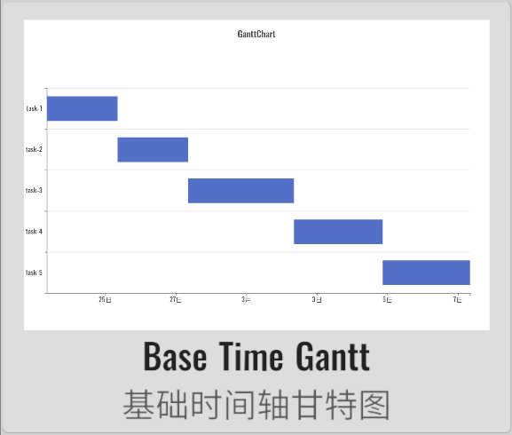
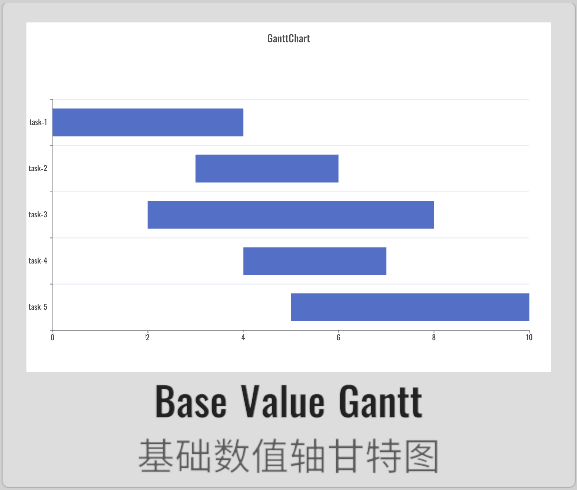
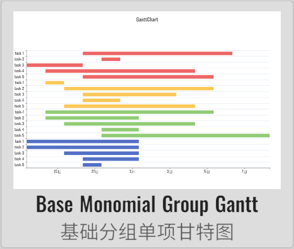

import APITable from '@site/src/components/APITable';

# GanttChart 甘特图

XCharts付费扩展图表 - 甘特图。

## 截图

||||||
| :--: | :--: | :--: | :--: | :--: |
| | | | | | |
| |

## 许可

扩展图表，需付费购买后才获得使用许可。

## 示例

Demo仓库：[XCharts-GanttChart-Demo](https://github.com/XCharts-Team/XCharts-GanttChart-Demo)

## 教程

[扩展图表如何导入Demo项目或导入自己项目](https://github.com/XCharts-Team/XCharts-Demo)

## 文档

[API](#api)  
[配置项手册](#配置项手册)  

## 日志

### v3.12.0

* (2024.09.30) 发布`v3.12.0`版本
* (2024.09.30) 更新文档

### v3.11.0

* (2024.06.16) 发布`v3.11.0`版本

### v3.10.0

* (2024.01.21) 增加`Gantt`的更多创建默认图表的快捷方式和API

### v3.9.0

* (2023.12.01) 发布`v3.9.0`版本
* (2023.12.01) 更新文档

### v3.8.0

* (2023.08.11) 增加鼠标事件支持

### v3.6.1

* (2023.06.08) 发布`v3.6.1`版本
* (2023.06.08) 更新文档

### v3.6.0

* (2023.04.01) 发布`v3.6.0`版本
* (2023.02.14) 同步`XCharts v3.6.0`

### v3.5.0

* (2022.12.01) 发布`v3.5.0`版本
* (2022.11.27) 调整`Documentation`文档结构

### v3.2.0

* (2022.08.22) 发布`v3.2.0`版本
* (2022.08.19) 同步`XCharts v3.2.0`

## API

### Gantt

class in XCharts.Runtime.Gantts / 继承自: [Serie](https://xcharts-team.github.io/docs/api#serie)

#### Gantt.AddDefaultCategorySerie

public static void AddDefaultCategorySerie(BaseChart chart, string serieName)  

#### Gantt.AddDefaultSerie

public static void AddDefaultSerie(BaseChart chart, string serieName)  

#### Gantt.AddDefaultValueSerie

public static void AddDefaultValueSerie(BaseChart chart, string serieName)  

### GanttChart

class in XCharts.Runtime.Gantts / 继承自: [BaseChart](https://xcharts-team.github.io/docs/api#basechart)

#### GanttChart.aliginingValue

public double aliginingValue  

#### GanttChart.runtimeBeginDrag

public bool runtimeBeginDrag  

#### GanttChart.runtimeDragLeft

public bool runtimeDragLeft  

#### GanttChart.runtimeDragSerie

public Serie runtimeDragSerie  

#### GanttChart.runtimeDragSerieData

public SerieData runtimeDragSerieData  

#### GanttChart.runtimeIsAlgining

public bool runtimeIsAlgining  

#### GanttChart.runtimeIsDragSerie

public bool runtimeIsDragSerie  

#### GanttChart.DefaultCategoryAxisGanttChart

public void DefaultCategoryAxisGanttChart()  
生成默认的类目轴甘特图。

#### GanttChart.DefaultMonomialGroupGanttChart

public void DefaultMonomialGroupGanttChart()  
生成默认的单维度分组甘特图。

#### GanttChart.DefaultMultinomialGroupGanttChart

public void DefaultMultinomialGroupGanttChart()  
生成默认的多维度分组甘特图。

#### GanttChart.DefaultValueAxisGanttChart

public void DefaultValueAxisGanttChart()  
生成默认的数值轴甘特图。

#### GanttChart.GetSeriesMinMaxValue

public override void GetSeriesMinMaxValue(Axis axis, int axisIndex, out double tempMinValue, out double tempMaxValue)  

#### GanttChart.InitAxisRuntimeData

public override void InitAxisRuntimeData(Axis axis)  

#### GanttChart.OnBeginDrag

public override void OnBeginDrag(PointerEventData eventData)  

#### GanttChart.OnDrag

public override void OnDrag(PointerEventData eventData)  

#### GanttChart.OnEndDrag

public override void OnEndDrag(PointerEventData eventData)  

#### GanttChart.OnPointerClick

public override void OnPointerClick(PointerEventData eventData)  

### GanttStyle

class in XCharts.Runtime.Gantts / 继承自: [MainComponent](https://xcharts-team.github.io/docs/api#maincomponent)

### GanttType

class in XCharts.Runtime.Gantts

可选：

- `Monomial`: 单项甘特图。每个数据项都是单独的一条进度。
- `Multinomial`: 多项甘特图。每个数据项只是一条进度里的一段。

## 配置项手册

### Gantt

class in XCharts.Runtime.Gantts / 继承自: [Serie](https://xcharts-team.github.io/docs/configuration#serie)

#### Gantt.disableDrag

`bool`

### GanttStyle

class in XCharts.Runtime.Gantts / 继承自: [MainComponent](https://xcharts-team.github.io/docs/configuration#maincomponent)

#### GanttStyle.aliginLine

`LineStyle`

对齐线样式。

#### GanttStyle.alignlineDataIndex

`int` `1`

显示对齐线的数据项索引。

#### GanttStyle.autoAdsorbAlignline

`bool` `true`

拖拽结束后是否自动吸附到对齐线。

#### GanttStyle.dragEnable

`bool` `true`

是否可以拖拽甘特图。

#### GanttStyle.dragRangeMax

`double` `0`

拖拽最大值限制。

#### GanttStyle.dragRangeMin

`double` `0`

拖拽最小值限制。

#### GanttStyle.dragSensitivity

`float` `1f`

拖拽的灵敏度。

#### GanttStyle.ganttType

[GanttType](#gantttype)

甘特图类型。

可选：

- `Monomial`: 单项甘特图。每个数据项都是单独的一条进度。
- `Multinomial`: 多项甘特图。每个数据项只是一条进度里的一段。

#### GanttStyle.invert

`bool` `true`

#### GanttStyle.show

`bool` `true`

#### GanttStyle.showAlignlineRange

`float` `10f`

显示对齐线的范围。

#### GanttStyle.splitArea

`AxisSplitArea`
