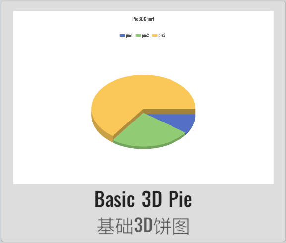
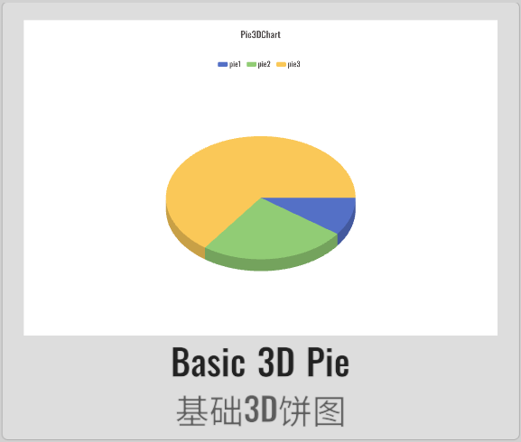
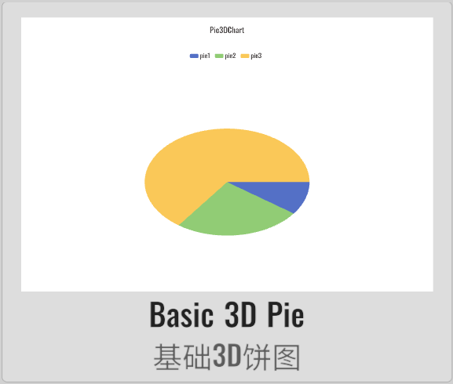
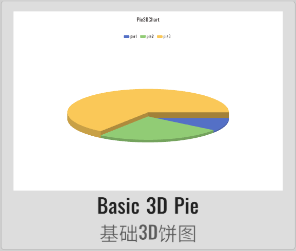
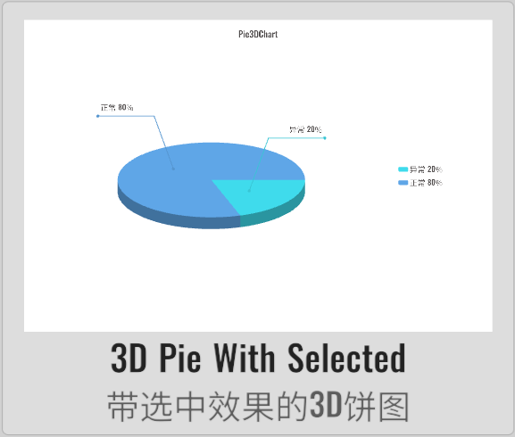

import APITable from '@site/src/components/APITable';

# Pie3DChart 3D饼图

XCharts的付费扩展图表 - 3D饼图。

## 截图

||||||
| :--: | :--: | :--: | :--: | :--: |
| | | | | | |
| | |

## 许可

扩展图表，需付费购买后才获得使用许可。

## 教程

[扩展图表如何导入Demo项目或导入自己项目](https://github.com/XCharts-Team/XCharts-Demo)

## 文档

[API](#api)  
[配置项手册](#配置项手册)  

## 日志

### v3.8.1

* (2023.09.14) 修复`SerieData`的数据为全为0时图表显示异常的问题
* (2023.09.08) 增加`SerieData`的`radius`可自定义各饼块高度的支持

### v3.8.0

* (2023.07.31) 同步`XCharts v3.8.0`

### v3.6.2

* (2023.06.08) 发布`v3.6.1`版本
* (2023.06.08) 更新文档

### v3.6.1

* (2023.05.21) 增加`avoidLabelOverlap`支持

### v3.6.0

* (2023.04.01) 发布`v3.6.0`版本
* (2023.03.09) 支持`onSerieClick` `onSerieDown` `onSerieEnter`和`onSerieExit`回调
* (2023.02.14) 同步`XCharts v3.6.0`

### v3.5.0

* (2022.12.01) 发布`v3.5.0`版本
* (2022.11.27) 调整`Documentation`文档结构

### v3.4.0

* (2022.11.01) 支持`Animation`的`unscaledTime`
* (2022.11.01) 同步`XCharts v3.4.0`

### v3.3.0

* (2022.09.02) 增加`onPointerEnterPie`回调支持

### v3.2.0

* (2022.08.22) 发布`v3.2.0`版本
* (2022.08.19) 同步`XCharts v3.2.0`

## API

### Pie3D

> class in XCharts.Runtime.Pie3Ds / 继承自: [Serie](https://xcharts-team.github.io/docs/api#serie)


|方法|版本|描述|
|--|--|--|
|AddDefaultSerie()||public static Serie AddDefaultSerie(BaseChart chart, string serieName)|
|ConvertSerie()||public static Pie3D ConvertSerie(Serie serie)|

### Pie3DChart

> class in XCharts.Runtime.Pie3Ds / 继承自: [BaseChart](https://xcharts-team.github.io/docs/api#basechart)

3D饼图。

### Pie3DSlice

> class in XCharts.Runtime.Pie3Ds

3D饼图的切块。

|方法|版本|描述|
|--|--|--|
|Contains()||public bool Contains(float angle)|
|IsInPolygon()||public bool IsInPolygon(Vector2 p)|
|IsInSidePolygon()||public bool IsInSidePolygon(Vector2 p)|
|IsInStartOrEndSide()||public bool IsInStartOrEndSide(Vector2 p)|
|IsInTopPolygon()||public bool IsInTopPolygon(Vector2 p)|
|Pie3DSlice()||public Pie3DSlice()|
|UpdateValue()||public void UpdateValue(int index, float start, float end, bool startSide, bool endSide, float maxHig)|

### Pie3DStyle

> class in XCharts.Runtime.Pie3Ds / 继承自: [ChildComponent](https://xcharts-team.github.io/docs/api#childcomponent)

3D饼图样式。

## 配置项手册

### Pie3D

> class in XCharts.Runtime.Pie3Ds / 继承自: [Serie](https://xcharts-team.github.io/docs/configuration#serie)

```mdx-code-block
<APITable name="Pie3D">
```

|参数|默认|版本|描述|
|--|--|--|--|
|pie3DStyle||| [Pie3DStyle](#pie3dstyle)|

```mdx-code-block
</APITable>
```

### Pie3DStyle

> class in XCharts.Runtime.Pie3Ds / 继承自: [ChildComponent](https://xcharts-team.github.io/docs/configuration#childcomponent)

3D饼图样式。

```mdx-code-block
<APITable name="Pie3DStyle">
```

|参数|默认|版本|描述|
|--|--|--|--|
|show|true||
|ellipseMinorAxis|0.65f||椭圆的短轴长度。当为0-1的浮点数时为长轴的百分比。
|pieMaxHeight|20f||饼图厚度。
|pieAutoHeight|false||是否自动根据比例计算厚度。
|selectedOffset|Vector2(0.1f, 0.5f)||The offset of selected pie slice. 被选中状态的饼图块的额外偏移。
|peripherySideColorRate|0.8f||饼图切块的侧面颜色。
|startSideColorRate|0.7f||饼图切块的起始面颜色（顺时针）。
|endSideColorRate|0.65f||饼图切块的结束面颜色（顺时针）。

```mdx-code-block
</APITable>
```

