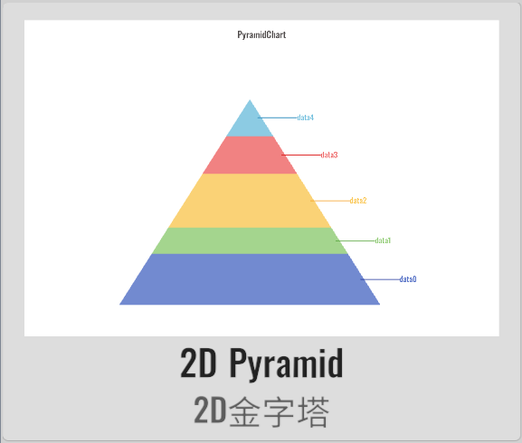

import APITable from '@site/src/components/APITable';

# PyramidChart 金字塔

XCharts付费扩展图表 - 金字塔。

## 截图

||||||
| :--: | :--: | :--: | :--: | :--: |
| | | |

## 许可

扩展图表，需付费购买后才获得使用许可。

## 教程

[扩展图表如何导入Demo项目或导入自己项目](https://github.com/XCharts-Team/XCharts-Demo)

## 文档

[API](#api)  
[配置项手册](#配置项手册)  

## 日志

### v3.6.1

* (2023.06.08) 发布`v3.6.1`版本
* (2023.06.08) 更新文档

### v3.6.0

* (2023.04.01) 发布`v3.6.0`版本
* (2023.03.21) 增加`Tooltip`支持
* (2023.02.14) 同步`XCharts v3.6.0`

### v3.5.0

* (2022.12.01) 发布`v3.5.0`版本
* (2022.11.27) 调整`Documentation`文档结构

### v3.2.0

* (2022.08.22) 发布`v3.2.0`版本
* (2022.08.19) 同步`XCharts v3.2.0`

## API

### PyramidChart

> XCharts.Runtime.Pyramids.PyramidChart : [BaseChart](https://xcharts-team.github.io/docs/api#basechart)

## 配置项手册

### Pyramid

> XCharts.Runtime.Pyramids.Pyramid : [Serie](https://xcharts-team.github.io/docs/configuration#serie)

```mdx-code-block
<APITable name="Pyramid">
```


|field|default|since|comment|
|--|--|--|--|
|pyramidStyle||| [PyramidStyle](#pyramidstyle)|

```mdx-code-block
</APITable>
```

### PyramidStyle

> XCharts.Runtime.Pyramids.PyramidStyle : [ChildComponent](https://xcharts-team.github.io/docs/configuration#childcomponent)

```mdx-code-block
<APITable name="PyramidStyle">
```


|field|default|since|comment|
|--|--|--|--|
|show|true||
|3D|true||
|drawTop|true||
|bottomPointRate|0.5f||3D模式下，底部中点占金字塔宽度的比例
|leftPointRate|0.1f||3D模式下，底部左边点占金字塔高度的比例
|rightPointRate|0.1f||3D模式下，底部右边点占金字塔高度的比例
|leftColorOpacity|0.9f||3D模式下，金字塔左边的颜色透明度
|rightColorOpacity|0.7f||3D模式下，金字塔右边的颜色透明度
|topColorOpacity|0.99f||3D模式下，金字塔顶部的颜色透明度
|labelLineMargin|10f||Label标签距离右边的距离

```mdx-code-block
</APITable>
```

