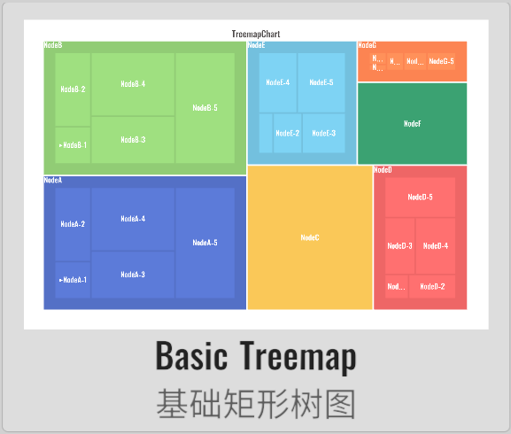

import APITable from '@site/src/components/APITable';

# TreemapChart 矩形树图

XCharts付费扩展图表 - 矩形树图。

## 截图

||||||
| :--: | :--: | :--: | :--: | :--: |
| | | | |

## 许可

扩展图表，需付费购买后才获得使用许可。

## 教程

[扩展图表如何导入Demo项目或导入自己项目](https://github.com/XCharts-Team/XCharts-Demo)

## 文档

[API](#api)  
[配置项手册](#配置项手册)  

## 日志

### v3.6.1

* (2023.06.08) 发布`v3.6.1`版本
* (2023.06.08) 更新文档

### v3.6.0

* (2023.04.01) 发布`v3.6.0`版本
* (2023.03.09) 支持`onSerieClick` `onSerieDown` `onSerieEnter`和`onSerieExit`回调
* (2023.02.14) 同步`XCharts v3.6.0`

### v3.5.0

* (2022.12.01) 发布`v3.5.0`版本
* (2022.11.27) 调整`Documentation`文档结构

### v3.2.0

* (2022.08.22) 发布`v3.2.0`版本
* (2022.08.19) 同步`XCharts v3.2.0`

## API

### TreemapChart

> XCharts.Runtime.Treemaps.TreemapChart : [BaseChart](https://xcharts-team.github.io/docs/api#basechart)

## 配置项手册

### Treemap

> XCharts.Runtime.Treemaps.Treemap : [Serie](https://xcharts-team.github.io/docs/configuration#serie)

```mdx-code-block
<APITable name="Treemap">
```


|field|default|since|comment|
|--|--|--|--|
|leafDepth|0||默认显示的几层节点。默认为0时表示尽可能展示多层节点，设置大于0时，下钻功能开启，需要点击后才展示子节点。
|visualDimension|0||用于计算占比的数据维数。
|drillDownIcon|||当节点可以下钻时的提示符，只能是字符。默认为▶
|customGoUpLevelButton|||自定义返回上一层按钮，自定义的按钮需要自己处理点击事件，调用GoUpALevel()接口。
|upperLabel|||父节点标签。show为true时表示显示父节点标签，margin参数设置子节点和父节点的间距。
|levelStyle|||

```mdx-code-block
</APITable>
```

