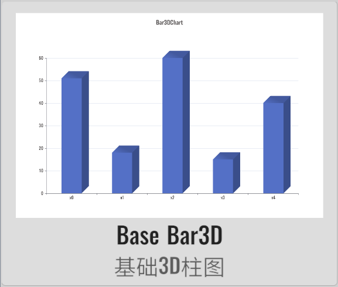
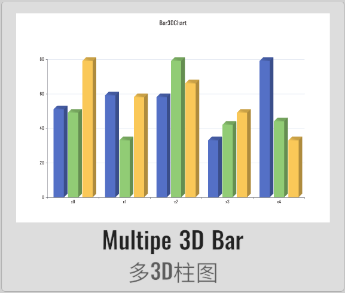
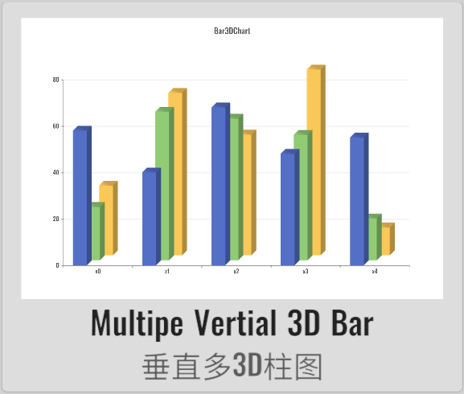
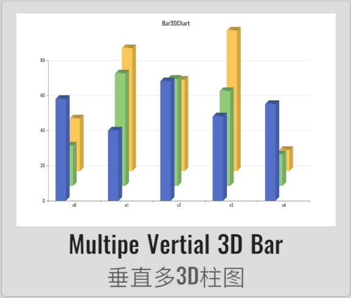
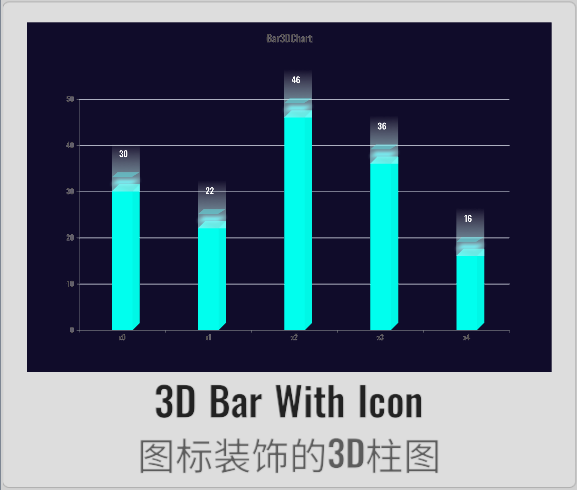
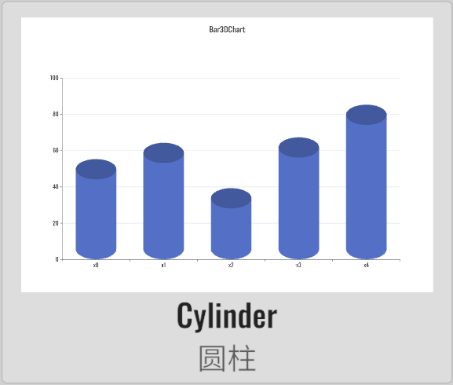
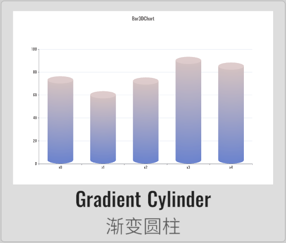
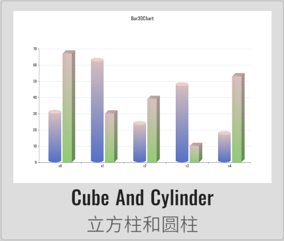

import APITable from '@site/src/components/APITable';

# Bar3DChart 3D柱图

XCharts的付费扩展图表 - 3D柱图。

## 截图

||||||
| :--: | :--: | :--: | :--: | :--: |
| | | | | | |
| | | | |

## 许可

扩展图表，需付费购买后才获得使用许可。

## 示例

Demo仓库：[XCharts-Bar3DChart-Demo](https://github.com/XCharts-Team/XCharts-Bar3DChart-Demo)

## 教程

[扩展图表如何导入Demo项目或导入自己项目](https://github.com/XCharts-Team/XCharts-Demo)

## 文档

[API](#api)  
[配置项手册](#配置项手册)  

## 日志

### v3.11.0

* (2024.06.16) 发布`v3.11.0`版本

### v3.10.0

* (2023.12.16) 增加`Bar3D`的更多默认图表快捷方式和API
* (2023.12.16) 增加`Bar3DStyle`的`borderDash`是否绘制虚线边框
* (2023.12.16) 增加`Bar3DStyle`的`occludedAreaBorderDash`是否绘制遮挡区域的虚线边框
* (2023.12.16) 增加`Bar3DStyle`的`occludedAreaBorder`是否绘制遮挡区域的边框
* (2023.12.16) 增加`Border`边框绘制支持

### v3.8.0

* (2023.07.31) 同步`XCharts v3.8.0`

### v3.6.1

* (2023.06.08) 发布`v3.6.1`版本
* (2023.06.08) 更新文档

### v3.6.0

* (2023.04.01) 发布`v3.6.0`版本
* (2023.03.09) 支持`onSerieClick` `onSerieDown` `onSerieEnter`和`onSerieExit`回调
* (2023.02.14) 同步`XCharts v3.6.0`
* (2023.02.14) 增加`Bar3DStyle`的`topColor`、`bottomColor`和`sideColor`参数支持

### v3.5.0

* (2022.11.29) 增加`Serie`的`barMaxWidth`参数支持
* (2022.11.27) 增加`Serie`的`ItemStyle`的`backgroundColor`参数支持
* (2022.11.27) 增加`Serie`的`colorBy`的支持
* (2022.11.27) 更新文档

### v3.4.0

* (2022.11.01) 支持`Animation`的`unscaledTime`
* (2022.11.01) 同步`XCharts v3.4.0`

### v3.2.0

* (2022.08.22) 发布`v3.2.0`版本
* (2022.08.19) 同步`XCharts v3.2.0`

### v3.1.0

* (2022.07.14) 发布`v3.1.0`版本
* (2022.07.14) 增加`bottomColorRate`,`cylinderRate`参数
* (2022.07.14) 调整`topColorBurnRate`改名为`topColorRate`
* (2022.07.14) 调整`sideColorBurnRate`改名为`sideColorRate`
* (2022.07.14) 调整`dire`改名为`cubeDire`
* (2022.07.14) 支持`Cylinder`圆柱和`Cube`立方柱

## API

### Bar3D

> class in XCharts.Runtime.Bar3Ds / 继承自: [Serie](https://xcharts-team.github.io/docs/api#serie),[INeedSerieContainer](https://xcharts-team.github.io/docs/api#ineedseriecontainer)

3D柱图。支持立方柱和圆柱。可水平排列和垂直排列。

|API|版本|描述|
|--|--|--|
|AddDefaultSerie()||public static Bar3D AddDefaultSerie(BaseChart chart, string serieName)|
|ConvertSerie()||public static Bar3D ConvertSerie(Serie serie)|

### Bar3DChart

> class in XCharts.Runtime.Bar3Ds / 继承自: [BaseChart](https://xcharts-team.github.io/docs/api#basechart)


|API|版本|描述|
|--|--|--|
|DefaultCylinderChart()||public void DefaultCylinderChart(){<br/>生成默认的圆柱体图。 |
|DefaultGroupedCubeChart()||public void DefaultGroupedCubeChart()<br/>默认分组3D柱状图。 |
|DefaultStackedCubeChart()||public void DefaultStackedCubeChart()<br/>默认堆叠分组3D柱状图。 |

### Bar3DStyle

> class in XCharts.Runtime.Bar3Ds / 继承自: [ChildComponent](https://xcharts-team.github.io/docs/api#childcomponent)


## 配置项手册

### Bar3D

> class in XCharts.Runtime.Bar3Ds / 继承自: [Serie](https://xcharts-team.github.io/docs/configuration#serie), [INeedSerieContainer](https://xcharts-team.github.io/docs/configuration#ineedseriecontainer)

3D柱图。支持立方柱和圆柱。可水平排列和垂直排列。

```mdx-code-block
<APITable name="Bar3D">
```

|参数|默认|版本|描述|
|--|--|--|--|
|bar3DType||v3.1.0|<br/>`Bar3DType`:<br/>- `Cube`: 立方柱。<br/>- `Cylinder`: 圆柱。<br/>|
|bar3DStyle||| [Bar3DStyle](#bar3dstyle)|

```mdx-code-block
</APITable>
```

### Bar3DStyle

> class in XCharts.Runtime.Bar3Ds / 继承自: [ChildComponent](https://xcharts-team.github.io/docs/configuration#childcomponent)

```mdx-code-block
<APITable name="Bar3DStyle">
```

|参数|默认|版本|描述|
|--|--|--|--|
|show|true||
|verticalArrange|false||是否垂直排列。
|verticalArrangeDire|Vector3(-1, 1)||垂直排列时的方向。
|verticalArrangeGap|0.5f||垂直排列时两个柱子间的间隙。
|barOffset|Vector3.zero||柱子偏移。
|widthRate|0.5f||方形柱侧边宽度相对正面的比例。
|topColorRate|0.8f||柱子顶部相对正面的颜色比例。
|bottomColorRate|1f||柱子底部相对正面的颜色比例。
|sideColorRate|0.7f||方形柱侧边相对正面的颜色比例。
|cubeDire|Vector3(1, 1)||方形柱形成3D效果的方向。
|cylinderRate|0.5f|v3.1.0|圆柱的顶部椭圆比列。
|topColor||v3.6.0|
|bottomColor||v3.6.0|
|sideColor||v3.6.0|
|occludedAreaBorder||v3.10.0|是否显示遮挡区域的边框。
|occludedAreaBorderDash||v3.10.0|是否显示遮挡区域的虚线边框。
|borderDash||v3.10.0|是否显示虚线边框。

```mdx-code-block
</APITable>
```

