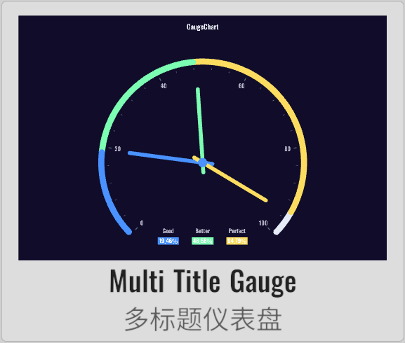
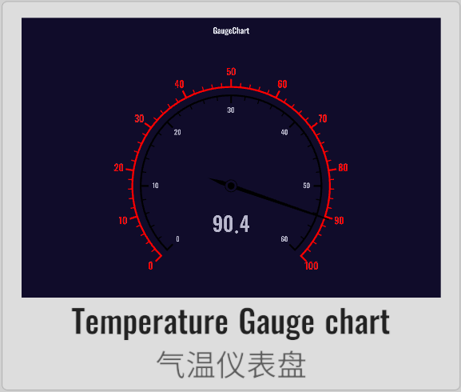
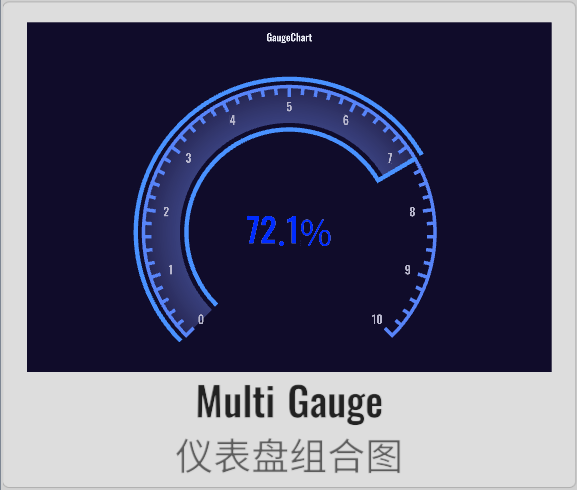
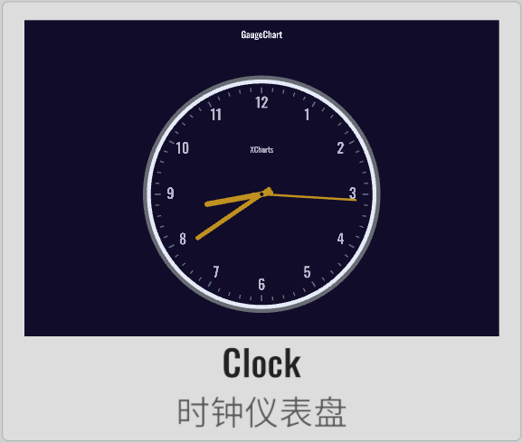

import APITable from '@site/src/components/APITable';

# GaugeChart 仪表盘

XCharts付费扩展图表 - 仪表盘。

## 截图

||||||
| :--: | :--: | :--: | :--: | :--: |
| | | | | | |
| | | | | |
| | | |

## 许可

扩展图表，需付费购买后才获得使用许可。

## 示例

Demo仓库：[XCharts-GaugeChart-Demo](https://github.com/XCharts-Team/XCharts-GaugeChart-Demo)

## 教程

[扩展图表如何导入Demo项目或导入自己项目](https://github.com/XCharts-Team/XCharts-Demo)

## 文档

[API](#api)  
[配置项手册](#配置项手册)  

## 日志

### v3.12.0

* (2024.09.30) 发布`v3.12.0`版本
* (2024.09.30) 更新文档

### v3.11.0

* (2024.06.16) 发布`v3.11.0`版本

### v3.10.0

* (2024.01.21) 增加`Gauge`的更多创建默认图表的快捷方式和API

### v3.9.0

* (2023.12.01) 发布`v3.9.0`版本
* (2023.12.01) 更新文档

### v3.8.0

* (2023.07.31) 同步`XCharts v3.8.0`

### v3.6.1

* (2023.06.08) 发布`v3.6.1`版本
* (2023.06.08) 更新文档

### v3.6.0

* (2023.04.01) 发布`v3.6.0`版本
* (2023.03.17) 增加`Gauge`的`rangeDataMode`可设置是否使用范围数据模式
* (2023.03.17) 增加`Gauge`的`loop`可设置是否循环数据，用于时钟甘特图
* (2023.03.17) 增加`GaugePointer`的`value`可设置指针位置
* (2023.03.17) 增加`Clock`时钟仪表盘支持
* (2023.03.13) 增加`GaugePointer`的`nowTime`可设置指针指向当前时间
* (2023.03.13) 增加`GaugePointer`的`value`可设置当前指针位置
* (2023.03.13) 增加`Clock`类型的甘特图支持
* (2023.02.14) 同步`XCharts v3.6.0`

### v3.5.0

* (2022.12.01) 发布`v3.5.0`版本
* (2022.11.27) 调整`Documentation`文档结构

### v3.4.0

* (2022.10.05) 增加`GaugeAxisLine`的`stageGradient`支持设置阶段渐变色过渡

### v3.3.0

* (2022.09.28) 发布`v3.3.0`版本
* (2022.08.26) 修复`Pointer`在普通模式下不显示的问题
* (2022.08.25) 增加`label`颜色跟随数值变化的支持

### v3.2.0

* (2022.08.22) 发布`v3.2.0`版本
* (2022.08.19) 同步`XCharts v3.2.0`
* (2022.08.15) 支持渐变

## API

### Gauge

class in XCharts.Runtime.Gauges / 继承自: [Serie](https://xcharts-team.github.io/docs/api#serie)

仪表盘系列数据。

#### Gauge.defaultColorBy

public override SerieColorBy defaultColorBy  

#### Gauge.AddDefaultSerie

public static void AddDefaultSerie(BaseChart chart, string serieName)  

#### Gauge.ClearComponentDirty

public override void ClearComponentDirty()  

#### Gauge.ClearVerticesDirty

public override void ClearVerticesDirty()  

#### Gauge.GetPointerColor

public Color32 GetPointerColor(ThemeStyle theme, int colorIndex, float angle, Color32 dataColor)  

### GaugeAnchor

class in XCharts.Runtime.Gauges / 继承自: [ChildComponent](https://xcharts-team.github.io/docs/api#childcomponent)

#### GaugeAnchor.GetPosition

public Vector3 GetPosition(Vector3 center, float radius)  

### GaugeAxis

class in XCharts.Runtime.Gauges / 继承自: [ChildComponent](https://xcharts-team.github.io/docs/api#childcomponent)

仪表盘轴线相关设置。

#### GaugeAxis.axisLabel

public AxisLabel axisLabel  
文本标签。

#### GaugeAxis.axisLabelText

public List&lt;string&gt; axisLabelText  
自定义Label的内容。

#### GaugeAxis.axisLine

public GaugeAxisLine axisLine  
仪表盘轴线样式。

#### GaugeAxis.axisTick

public AxisTick axisTick  
刻度。

#### GaugeAxis.distance

public float distance  

#### GaugeAxis.overlap

public bool overlap  

#### GaugeAxis.show

public bool show  

#### GaugeAxis.splitLine

public AxisSplitLine splitLine  
分割线。

#### GaugeAxis.type

public GaugeAxisType type  

#### GaugeAxis.AddLabelObject

public void AddLabelObject(ChartLabel label)  

#### GaugeAxis.ClearLabelObject

public void ClearLabelObject()  

#### GaugeAxis.GaugeAxis

public GaugeAxis()  

#### GaugeAxis.GetLabelObject

public ChartLabel GetLabelObject(int index)  

#### GaugeAxis.GetStageColor

public Color32 GetStageColor(float rate)  

#### GaugeAxis.GetStageColorByAngle

public Color32 GetStageColorByAngle(float angle)  

#### GaugeAxis.SetLabelObjectActive

public void SetLabelObjectActive(bool flag)  

#### GaugeAxis.SetLabelObjectPosition

public void SetLabelObjectPosition(int index, Vector3 pos)  

#### GaugeAxis.SetLabelObjectText

public void SetLabelObjectText(int index, string text)  

### GaugeAxisLine

class in XCharts.Runtime.Gauges / 继承自: [BaseLine](https://xcharts-team.github.io/docs/api#baseline)

#### GaugeAxisLine.backgroundColor

public Color32 backgroundColor  
进度条背景颜色。

#### GaugeAxisLine.stageColor

public List&lt;StageColor&gt; stageColor  
阶段颜色。

#### GaugeAxisLine.stageGradient

public bool stageGradient  
阶段颜色是否渐变过渡。

#### GaugeAxisLine.GaugeAxisLine

public GaugeAxisLine(bool show) : base(show)  

### GaugeAxisType

class in XCharts.Runtime.Gauges

仪表盘类型

可选：

- `None`: 仪表盘类型
- `Section`: 分段
- `Progress`: 进度

### GaugeChart

class in XCharts.Runtime.Gauges / 继承自: [BaseChart](https://xcharts-team.github.io/docs/api#basechart)

仪表盘。

#### GaugeChart.DefaultBarometerGaugeChart

public void DefaultBarometerGaugeChart()  
生成气压计仪表盘。

#### GaugeChart.DefaultClockGaugeChart

public void DefaultClockGaugeChart()  
生成时钟仪表盘。

#### GaugeChart.DefaultMultipleGaugeChart

public void DefaultMultipleGaugeChart()  
生成多仪表盘。

#### GaugeChart.DefaultProgressGaugeChart

public void DefaultProgressGaugeChart()  
生成进度仪表盘。

#### GaugeChart.DefaultRangeClockGaugeChart

public void DefaultRangeClockGaugeChart()  

#### GaugeChart.DefaultSectionGaugeChart

public void DefaultSectionGaugeChart()  
生成分段仪表盘。

#### GaugeChart.UpdateClockTime

public void UpdateClockTime(double hour, double minute, double second)  
更新时钟时间。

#### GaugeChart.UpdatePointerValue

public void UpdatePointerValue(double value)  
更新指针值。

### GaugePointer

class in XCharts.Runtime.Gauges / 继承自: [ChildComponent](https://xcharts-team.github.io/docs/api#childcomponent)

仪表盘指针相关设置。

## 配置项手册

### Gauge

class in XCharts.Runtime.Gauges / 继承自: [Serie](https://xcharts-team.github.io/docs/configuration#serie)

仪表盘系列数据。

#### Gauge.gaugeAnchor

[GaugeAnchor](#gaugeanchor)

仪表盘指针固定点。

#### Gauge.gaugeAxis

[GaugeAxis](#gaugeaxis)

仪表盘轴线。

#### Gauge.gaugePointer

[GaugePointer](#gaugepointer)

仪表盘指针。

#### Gauge.loop

`bool` `false` `v3.6.0`

数值是否循环。可用在钟表图。

#### Gauge.rangeDataMode

`bool` `false` `v3.6.0`

数值是否为范围数据。启用该模式后，data中的每个值都是一个数组，数组中的第一个值为起始值，第二个值为结束值。指针只有一个，数据绘制为环形。

### GaugeAnchor

class in XCharts.Runtime.Gauges / 继承自: [ChildComponent](https://xcharts-team.github.io/docs/configuration#childcomponent)

#### GaugeAnchor.gap

`float` `0`

图形标记和线条的间隙距离。

#### GaugeAnchor.image

`Sprite`

自定义的标记图形。

#### GaugeAnchor.imageType

`Image.Type`

#### GaugeAnchor.itemStyle

`ItemStyle`

图形样式。

#### GaugeAnchor.offsetCenter

`Vector2` `Vector2(0, 0)`

相对于中心的偏移位置。

#### GaugeAnchor.show

`bool` `true`

是否显示指针固定点。

#### GaugeAnchor.showAbove

`bool` `true`

固定点是否显示在指针上面。

#### GaugeAnchor.size

`float` `6`

标记的大小。

#### GaugeAnchor.type

`SymbolType`

标记类型。

### GaugeAxis

class in XCharts.Runtime.Gauges / 继承自: [ChildComponent](https://xcharts-team.github.io/docs/configuration#childcomponent)

仪表盘轴线相关设置。

#### GaugeAxis.axisLabel

`AxisLabel`

文本标签。

#### GaugeAxis.axisLabelText

`List<string>`

自定义Label的内容。

#### GaugeAxis.axisLine

[GaugeAxisLine](#gaugeaxisline)

仪表盘轴线样式。

#### GaugeAxis.axisTick

`AxisTick`

刻度。

#### GaugeAxis.distance

`float`

#### GaugeAxis.overlap

`bool` `true`

#### GaugeAxis.show

`bool` `true`

#### GaugeAxis.splitLine

`AxisSplitLine`

分割线。

#### GaugeAxis.type

[GaugeAxisType](#gaugeaxistype)

可选：

- `None`: 仪表盘类型
- `Section`: 分段
- `Progress`: 进度

### GaugeAxisLine

class in XCharts.Runtime.Gauges / 继承自: [BaseLine](https://xcharts-team.github.io/docs/configuration#baseline)

#### GaugeAxisLine.backgroundColor

`Color32` `Color32(230, 235, 248, 255)`

进度条背景颜色。

#### GaugeAxisLine.stageColor

`List<StageColor>`

阶段颜色。

#### GaugeAxisLine.stageGradient

`bool` `v3.4.0`

阶段颜色是否渐变过渡。

### GaugePointer

class in XCharts.Runtime.Gauges / 继承自: [ChildComponent](https://xcharts-team.github.io/docs/configuration#childcomponent)

仪表盘指针相关设置。

#### GaugePointer.autoColor

`bool` `true`

#### GaugePointer.backExtraLength

`float` `0.05f`

指针后额外的长度。可以是绝对值，也可以是相对于半径的百分比（0-1的浮点数）。

#### GaugePointer.backLength

`float` `0.05f`

指针后凸出的长度。可以是绝对值，也可以是相对于半径的百分比（0-1的浮点数）。

#### GaugePointer.bottomLeftLength

`float` `0.025f`

指针底部左边凸起长度。可以是绝对值，也可以是相对于半径的百分比（0-1的浮点数）。

#### GaugePointer.bottomRightLength

`float` `0.025f`

指针底部右边凸起长度。可以是绝对值，也可以是相对于半径的百分比（0-1的浮点数）。

#### GaugePointer.color

`Color32`

#### GaugePointer.cornerRadius

`float[]`

圆角半径。用数组分别指定4个圆角半径（顺时针左上，右上，右下，左下）。

#### GaugePointer.distance

`float`

#### GaugePointer.length

`float` `0.6f`

指针长度。可以是绝对值，也可以是相对于半径的百分比（0-1的浮点数）。

#### GaugePointer.roundCap

`bool`

#### GaugePointer.show

`bool` `true`

是否显示指针。

#### GaugePointer.toColor

`Color32`

#### GaugePointer.topLeftLength

`float` `0f`

指针顶部左边凸起长度。可以是绝对值，也可以是相对于半径的百分比（0-1的浮点数）。

#### GaugePointer.topRightLength

`float` `0f`

指针顶部右边凸起长度。可以是绝对值，也可以是相对于半径的百分比（0-1的浮点数）。

#### GaugePointer.value

`double` `v3.6.0`

指针的值。当为时钟仪表盘时，可通过指定value值来控制指针的位置。
