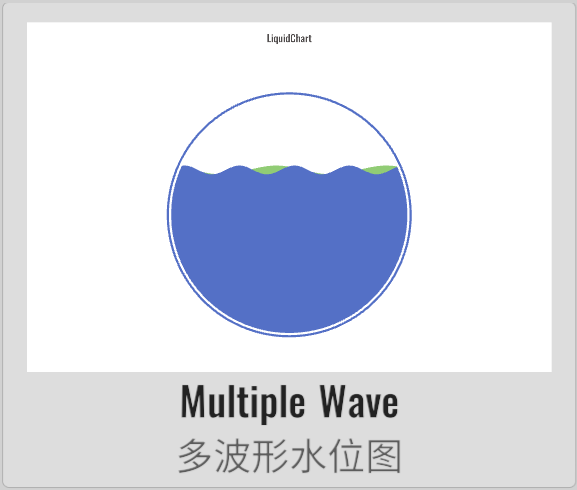
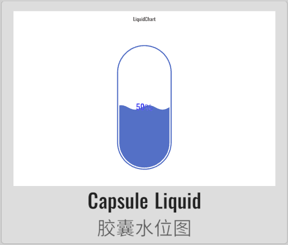
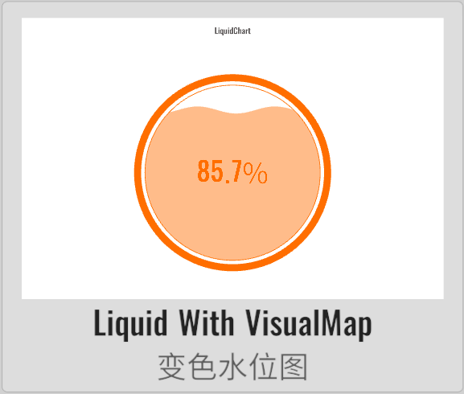

import APITable from '@site/src/components/APITable';

# LiquidChart 水位图

XCharts的付费扩展图表 - 水位图。

## 截图

||||||
| :--: | :--: | :--: | :--: | :--: |
| | | | | | |
| | |

## 许可

扩展图表，需付费购买后才获得使用许可。

## 示例

Demo仓库：[XCharts-LiquidChart-Demo](https://github.com/XCharts-Team/XCharts-LiquidChart-Demo)

## 教程

[扩展图表如何导入Demo项目或导入自己项目](https://github.com/XCharts-Team/XCharts-Demo)

## 文档

[API](#api)  
[配置项手册](#配置项手册)  

## 日志

### v3.12.0

* (2024.09.30) 发布`v3.12.0`版本
* (2024.09.30) 更新文档

### v3.11.0

* (2024.06.16) 发布`v3.11.0`版本

### v3.10.0

* (2024.01.21) 增加`Liquid`的更多创建默认图表的快捷方式和API

### v3.9.0

* (2023.12.01) 发布`v3.9.0`版本
* (2023.12.01) 更新文档

### v3.8.0

* (2023.07.31) 同步`XCharts v3.8.0`

### v3.6.1

* (2023.06.08) 发布`v3.6.1`版本
* (2023.06.08) 更新文档

### v3.6.0

* (2023.04.01) 发布`v3.6.0`版本
* (2023.02.14) 同步`XCharts v3.6.0`

### v3.5.0

* (2022.12.01) 发布`v3.5.0`版本
* (2022.11.27) 调整`Documentation`文档结构

### v3.4.0

* (2022.11.01) 支持`Animation`的`unscaledTime`
* (2022.11.01) 同步`XCharts v3.4.0`

### v3.2.0

* (2022.08.22) 发布`v3.2.0`版本
* (2022.08.19) 同步`XCharts v3.2.0`

## API

### Liquid

class in XCharts.Runtime.Liquids / 继承自: [Serie](https://xcharts-team.github.io/docs/api#serie),[INeedSerieContainer](https://xcharts-team.github.io/docs/api#ineedseriecontainer)

#### Liquid.containerIndex

public int containerIndex  

#### Liquid.containterInstanceId

public int containterInstanceId  

#### Liquid.AddDefaultSerie

public static Serie AddDefaultSerie(BaseChart chart, string serieName)  

### LiquidChart

class in XCharts.Runtime.Liquids / 继承自: [BaseChart](https://xcharts-team.github.io/docs/api#basechart)

水位图

#### LiquidChart.DefaultCapsuleLiquidChart

public void DefaultCapsuleLiquidChart()  
generate default capsule liquid chart. 生成默认的胶囊形水位图。

#### LiquidChart.DefaultRectLiquidChart

public void DefaultRectLiquidChart()  
generate default rect liquid chart. 生成默认的矩形水位图。

#### LiquidChart.DefaultRoundRectLiquidChart

public void DefaultRoundRectLiquidChart()  
generate default round rect liquid chart. 生成默认的圆角矩形水位图。

### Vessel

class in XCharts.Runtime.Liquids / 继承自: [MainComponent](https://xcharts-team.github.io/docs/api#maincomponent),[ISerieContainer](https://xcharts-team.github.io/docs/api#iseriecontainer),[IUpdateRuntimeData](https://xcharts-team.github.io/docs/api#iupdateruntimedata)

容器组件。 一般用于LiquidChart。一个Chart中可以有多个Vessel，Serie中用vesselIndex来对应。

#### Vessel.IsPointerEnter

public bool IsPointerEnter()  

#### Vessel.UpdateRuntimeData

public void UpdateRuntimeData(BaseChart chart)  

### Vessel.Shape

class in XCharts.Runtime.Liquids

容器组件。 一般用于LiquidChart。一个Chart中可以有多个Vessel，Serie中用vesselIndex来对应。

可选：

- `Circle`: 圆形
- `Rect`: 正方形。
- `Triangle`: 三角形。
- `Diamond`: 菱形。

### VesselContext

class in XCharts.Runtime.Liquids / 继承自: [MainComponentContext](https://xcharts-team.github.io/docs/api#maincomponentcontext)

#### VesselContext.center

public Vector3 center  
运行时中心点。

#### VesselContext.height

public float height  

#### VesselContext.innerRadius

public float innerRadius  
运行时内半径。扣除厚度和间隙后的实际半径。

#### VesselContext.isPointerEnter

public bool isPointerEnter  

#### VesselContext.radius

public float radius  
运行时半径。

#### VesselContext.width

public float width  

## 配置项手册

### Liquid

class in XCharts.Runtime.Liquids / 继承自: [Serie](https://xcharts-team.github.io/docs/configuration#serie), [INeedSerieContainer](https://xcharts-team.github.io/docs/configuration#ineedseriecontainer)

#### Liquid.waveHeight

`float` `10f`

波高。

#### Liquid.waveLength

`float` `20f`

波长。为0-1小数时指直线的百分比。

#### Liquid.waveOffset

`float` `0f`

波偏移。

#### Liquid.waveSpeed

`float` `5f`

波速。正数时左移，负数时右移。

### Vessel

class in XCharts.Runtime.Liquids / 继承自: [MainComponent](https://xcharts-team.github.io/docs/configuration#maincomponent), [ISerieContainer](https://xcharts-team.github.io/docs/configuration#iseriecontainer), [IUpdateRuntimeData](https://xcharts-team.github.io/docs/configuration#iupdateruntimedata)

容器组件。 一般用于LiquidChart。一个Chart中可以有多个Vessel，Serie中用vesselIndex来对应。

#### Vessel.autoColor

`bool` `true`

是否自动颜色。为true时颜色会和serie一致。 [default: true]

#### Vessel.backgroundColor

`Color32`

背景色，默认透明。 [default: `Color.clear`]

#### Vessel.borderColor

`Color32` `Color32(70, 70, 240, 255)`

容器内壁边框颜色。默认和serie一致。

#### Vessel.borderWidth

`float` `0f`

内壁边框。

#### Vessel.center

`float[]`

When value between 0 and 1 represents a percentage  relative to the chart.

#### Vessel.color

`Color32` `Color32(70, 70, 240, 255)`

容器颜色。默认和serie一致。

#### Vessel.cornerRadius

`float[]`

容器的圆角半径。用数组分别指定4个圆角半径（顺时针左上，右上，右下，左下）。shape为Rect时有效。

#### Vessel.gap

`float` `5f`

间隙。容器和液体的间隙。 [defaut: 10f]

#### Vessel.height

`float` `0.7f`

When value between 0 and 1 represents a percentage relative to the chart.

#### Vessel.radius

`float` `0.35f`

When value between 0 and 1 represents a percentage relative to the chart.

#### Vessel.shape

[Vessel.Shape](#vesselshape)

容器形状。 [default: Shape.Circle]

可选：

- `Circle`: 圆形
- `Rect`: 正方形。
- `Triangle`: 三角形。
- `Diamond`: 菱形。

#### Vessel.shapeWidth

`float` `5f`

容器厚度。 [defaut: 5f]

#### Vessel.show

`bool` `true`

是否显示容器组件。 [defaut: true]

#### Vessel.smoothness

`float` `1f`

水波平滑度。 [default: 1f]

#### Vessel.width

`float` `0.5f`

When value between 0 and 1 represents a percentage relative to the chart.
