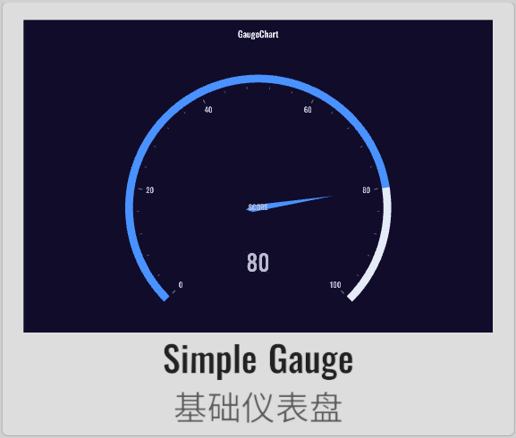
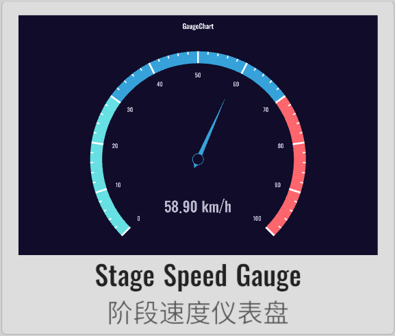
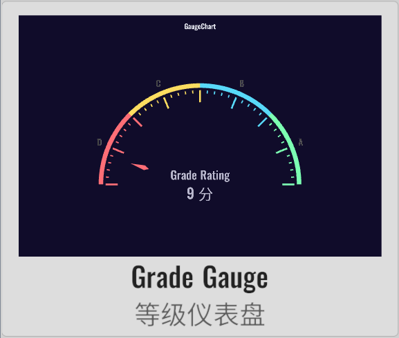
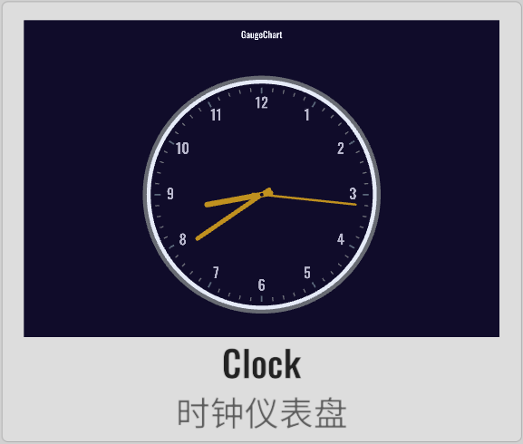
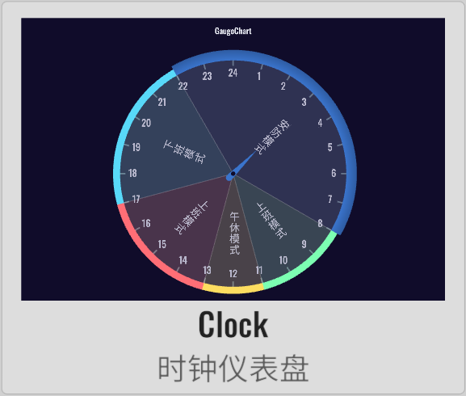

import APITable from '@site/src/components/APITable';

# GaugeChart 仪表盘

XCharts付费扩展图表 - 仪表盘。

## 截图

||||||
| :--: | :--: | :--: | :--: | :--: |
| | | | | | |
| | | | | |
| | | |

## 许可

扩展图表，需付费购买后才获得使用许可。

## 教程

[扩展图表如何导入Demo项目或导入自己项目](https://github.com/XCharts-Team/XCharts-Demo)

## 文档

[API](#api)  
[配置项手册](#配置项手册)  

## 日志

### v3.9.0

* (2023.12.01) 发布`v3.9.0`版本
* (2023.12.01) 更新文档

### v3.8.0

* (2023.07.31) 同步`XCharts v3.8.0`

### v3.6.1

* (2023.06.08) 发布`v3.6.1`版本
* (2023.06.08) 更新文档

### v3.6.0

* (2023.04.01) 发布`v3.6.0`版本
* (2023.03.17) 增加`Gauge`的`rangeDataMode`可设置是否使用范围数据模式
* (2023.03.17) 增加`Gauge`的`loop`可设置是否循环数据，用于时钟甘特图
* (2023.03.17) 增加`GaugePointer`的`value`可设置指针位置
* (2023.03.17) 增加`Clock`时钟仪表盘支持
* (2023.03.13) 增加`GaugePointer`的`nowTime`可设置指针指向当前时间
* (2023.03.13) 增加`GaugePointer`的`value`可设置当前指针位置
* (2023.03.13) 增加`Clock`类型的甘特图支持
* (2023.02.14) 同步`XCharts v3.6.0`

### v3.5.0

* (2022.12.01) 发布`v3.5.0`版本
* (2022.11.27) 调整`Documentation`文档结构

### v3.4.0

* (2022.10.05) 增加`GaugeAxisLine`的`stageGradient`支持设置阶段渐变色过渡

### v3.3.0

* (2022.09.28) 发布`v3.3.0`版本
* (2022.08.26) 修复`Pointer`在普通模式下不显示的问题
* (2022.08.25) 增加`label`颜色跟随数值变化的支持

### v3.2.0

* (2022.08.22) 发布`v3.2.0`版本
* (2022.08.19) 同步`XCharts v3.2.0`
* (2022.08.15) 支持渐变

## API

### Gauge

> class in XCharts.Runtime.Gauges / 继承自: [Serie](https://xcharts-team.github.io/docs/api#serie)


|API|版本|描述|
|--|--|--|
|AddDefaultSerie()||public static void AddDefaultSerie(BaseChart chart, string serieName)|
|ClearComponentDirty()||public override void ClearComponentDirty()|
|ClearVerticesDirty()||public override void ClearVerticesDirty()|
|GetPointerColor()||public Color32 GetPointerColor(ThemeStyle theme, int colorIndex, float angle, Color32 dataColor)|

### GaugeAnchor

> class in XCharts.Runtime.Gauges / 继承自: [ChildComponent](https://xcharts-team.github.io/docs/api#childcomponent)


|API|版本|描述|
|--|--|--|
|GetPosition()||public Vector3 GetPosition(Vector3 center, float radius)|

### GaugeAxis

> class in XCharts.Runtime.Gauges / 继承自: [ChildComponent](https://xcharts-team.github.io/docs/api#childcomponent)

仪表盘轴线相关设置。

|API|版本|描述|
|--|--|--|
|AddLabelObject()||public void AddLabelObject(ChartLabel label)|
|ClearLabelObject()||public void ClearLabelObject()|
|GaugeAxis()||public GaugeAxis()|
|GetLabelObject()||public ChartLabel GetLabelObject(int index)|
|GetStageColor()||public Color32 GetStageColor(float rate)|
|GetStageColorByAngle()||public Color32 GetStageColorByAngle(float angle)|
|SetLabelObjectActive()||public void SetLabelObjectActive(bool flag)|
|SetLabelObjectPosition()||public void SetLabelObjectPosition(int index, Vector3 pos)|
|SetLabelObjectText()||public void SetLabelObjectText(int index, string text)|

### GaugeAxisLine

> class in XCharts.Runtime.Gauges / 继承自: [BaseLine](https://xcharts-team.github.io/docs/api#baseline)


|API|版本|描述|
|--|--|--|
|GaugeAxisLine()||public GaugeAxisLine(bool show) : base(show)|

### GaugeChart

> class in XCharts.Runtime.Gauges / 继承自: [BaseChart](https://xcharts-team.github.io/docs/api#basechart)


### GaugePointer

> class in XCharts.Runtime.Gauges / 继承自: [ChildComponent](https://xcharts-team.github.io/docs/api#childcomponent)

仪表盘指针相关设置。

## 配置项手册

### Gauge

> class in XCharts.Runtime.Gauges / 继承自: [Serie](https://xcharts-team.github.io/docs/configuration#serie)

```mdx-code-block
<APITable name="Gauge">
```

|参数|默认|版本|描述|
|--|--|--|--|
|rangeDataMode|false|v3.6.0|数值是否为范围数据。启用该模式后，data中的每个值都是一个数组，数组中的第一个值为起始值，第二个值为结束值。指针只有一个，数据绘制为环形。
|loop|false|v3.6.0|数值是否循环。可用在钟表图。
|gaugeAxis|||仪表盘轴线。 [GaugeAxis](#gaugeaxis)|
|gaugePointer|||仪表盘指针。 [GaugePointer](#gaugepointer)|
|gaugeAnchor|||仪表盘指针固定点。 [GaugeAnchor](#gaugeanchor)|

```mdx-code-block
</APITable>
```

### GaugeAnchor

> class in XCharts.Runtime.Gauges / 继承自: [ChildComponent](https://xcharts-team.github.io/docs/configuration#childcomponent)

```mdx-code-block
<APITable name="GaugeAnchor">
```

|参数|默认|版本|描述|
|--|--|--|--|
|show|true||是否显示指针固定点。
|showAbove|true||固定点是否显示在指针上面。
|type|||标记类型。
|size|6||标记的大小。
|gap|0||图形标记和线条的间隙距离。
|image|||自定义的标记图形。
|imageType|||
|offsetCenter|Vector2(0, 0)||相对于中心的偏移位置。
|itemStyle|||图形样式。

```mdx-code-block
</APITable>
```

### GaugeAxis

> class in XCharts.Runtime.Gauges / 继承自: [ChildComponent](https://xcharts-team.github.io/docs/configuration#childcomponent)

仪表盘轴线相关设置。

```mdx-code-block
<APITable name="GaugeAxis">
```

|参数|默认|版本|描述|
|--|--|--|--|
|show|true||
|type|||<br/>`GaugeAxisType`:<br/>- `None`: 仪表盘类型<br/>- `Section`: 分段<br/>- `Progress`: 进度<br/>|
|overlap|true||
|distance|||
|axisLine|||仪表盘轴线样式。 [GaugeAxisLine](#gaugeaxisline)|
|splitLine|||分割线。
|axisTick|||刻度。
|axisLabel|||文本标签。
|axisLabelText|||自定义Label的内容。

```mdx-code-block
</APITable>
```

### GaugeAxisLine

> class in XCharts.Runtime.Gauges / 继承自: [BaseLine](https://xcharts-team.github.io/docs/configuration#baseline)

```mdx-code-block
<APITable name="GaugeAxisLine">
```

|参数|默认|版本|描述|
|--|--|--|--|
|backgroundColor|Color32(230, 235, 248, 255)||进度条背景颜色。
|stageColor|||阶段颜色。
|stageGradient||v3.4.0|阶段颜色是否渐变过渡。

```mdx-code-block
</APITable>
```

### GaugePointer

> class in XCharts.Runtime.Gauges / 继承自: [ChildComponent](https://xcharts-team.github.io/docs/configuration#childcomponent)

仪表盘指针相关设置。

```mdx-code-block
<APITable name="GaugePointer">
```

|参数|默认|版本|描述|
|--|--|--|--|
|show|true||是否显示指针。
|length|0.6f||指针长度。可以是绝对值，也可以是相对于半径的百分比（0-1的浮点数）。
|backLength|0.05f||指针后凸出的长度。可以是绝对值，也可以是相对于半径的百分比（0-1的浮点数）。
|backExtraLength|0.05f||指针后额外的长度。可以是绝对值，也可以是相对于半径的百分比（0-1的浮点数）。
|topLeftLength|0f||指针顶部左边凸起长度。可以是绝对值，也可以是相对于半径的百分比（0-1的浮点数）。
|topRightLength|0f||指针顶部右边凸起长度。可以是绝对值，也可以是相对于半径的百分比（0-1的浮点数）。
|bottomLeftLength|0.025f||指针底部左边凸起长度。可以是绝对值，也可以是相对于半径的百分比（0-1的浮点数）。
|bottomRightLength|0.025f||指针底部右边凸起长度。可以是绝对值，也可以是相对于半径的百分比（0-1的浮点数）。
|distance|||
|roundCap|||
|autoColor|true||
|color|||
|toColor|||
|cornerRadius|||圆角半径。用数组分别指定4个圆角半径（顺时针左上，右上，右下，左下）。
|value||v3.6.0|指针的值。当为时钟仪表盘时，可通过指定value值来控制指针的位置。

```mdx-code-block
</APITable>
```

